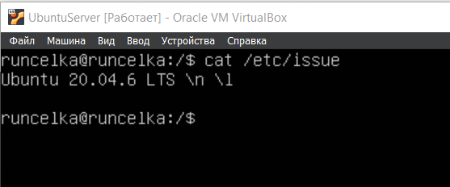
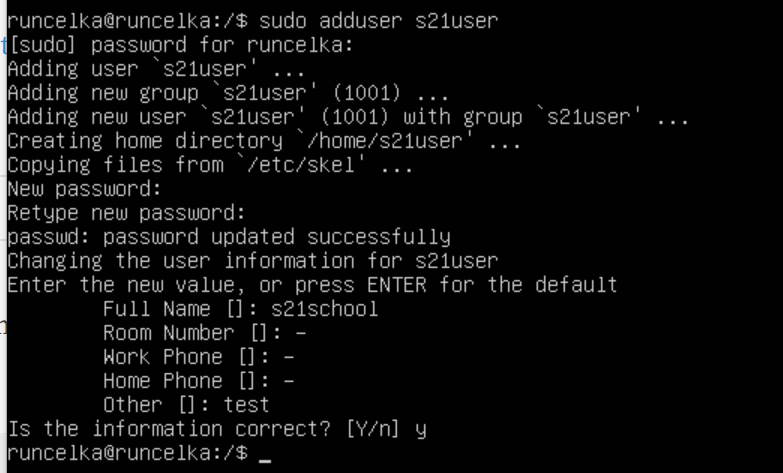
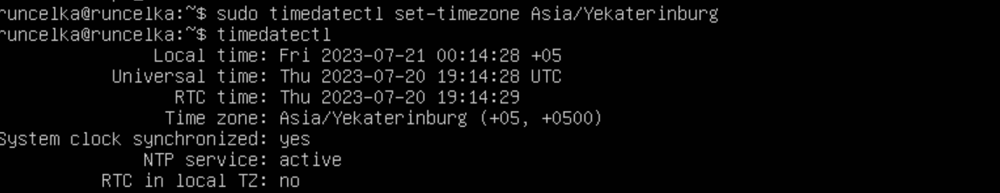
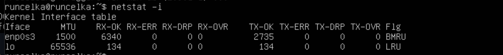
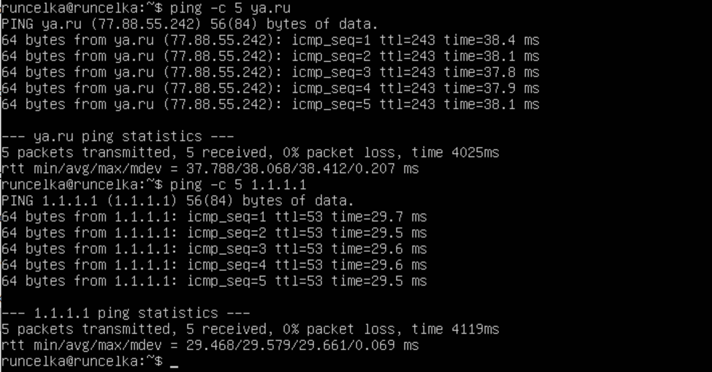
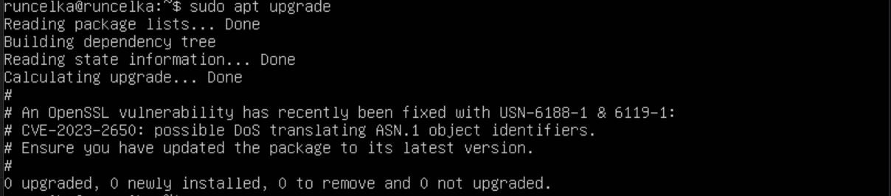

## 1. Part 1. Установка ОС
1. Установка Ubuntu Server 20.04 LTS без графического интерфейса
___
2. Вывод версии Убунту в консоли:

## Part 2. Создание пользователя
1. Создание пользователя, отличного от начального, который был задан при установке:
   
___

2.  Добавление пользователя в группу adm:
   
___
3. Вывод команды  `cat /etc/passwd`:
   

## Part 3. Настройка сети ОС
1. Задаем машине имя __user-1__:
   
   ___
2. Установить временную зону, соответствующую моему текущему местоположению:
   
   ___
3. Вывести названия сетевых интерфейсов с помощью консольной команды:
   
   >(lo) Loopback — виртуальный интерфейс, который по умолчанию присутствует в любом Linux. Это совокупность методов, нужных для корректной работы маршрутизатора и передачи данных. Сам интерфейс же является отображением логических процессов в маршрутизаторе. Также саму технологию используют и для других целей: тестирование передачи данных от обслуживающего центра коммутации; проверка сигнала на расстоянии; обеспечение работы коммутационных кабелей и их проверка; тест обратной петли, когда сигнал посылается и возвращается отправителю по всем коммуникационным каналам.
   ___
4. Используя консольную команду получить ip адрес устройства  от DHCP сервера:`10.0.2.15`
   
   
   >Протокол DHCP (Dynamic Host Configuration Protocol) относится к числу основных служб, формирующих инфраструктуру сетей. Он применяется для автоматического выполнения конфигурации сетевых параметров.
___
1. Определить и вывести на экран внешний ip-адрес шлюза (ip) и внутренний IP-адрес шлюза, он же ip-адрес по умолчанию (gw) :
   * Внешний несколько способов через команду `curl`, мой внешний ip : `79.172.16.100`

    * Мой внутренний ip : `10.0.2.15`
    
    ___
1. Задать статичные (заданные вручную, а не полученные от DHCP сервера) настройки ip, gw, dns (использовать публичный DNS серверы, например 1.1.1.1 или 8.8.8.8) : 
  * Использовал команду `sudo vim /etc/netplan/00-installer-config.yaml` чтобы изменить настройки адреса вручную и привел в такой вид:
  

  * Сохранил настройки с помощью команды `sudo netplan apply`
  * Через команду `ip route` увидел статический адрес:
  

  * После перезагрузки изменения сохранились:
  

  * Пропинговал удаленные хосты 1.1.1.1 и ya.ru:
  

## Part 4. Обновление ОС
1. Использовал команду `sudo apt update` для синхронизации пакетов
   ___
2. Использовал команду `sudo apt upgrade` для обновления 
   ___
3. Повторно запускаем предыдущую команду для проверки, что больше обновлений нет:
