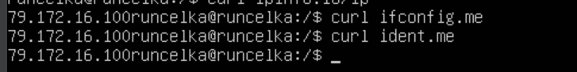
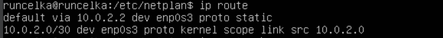
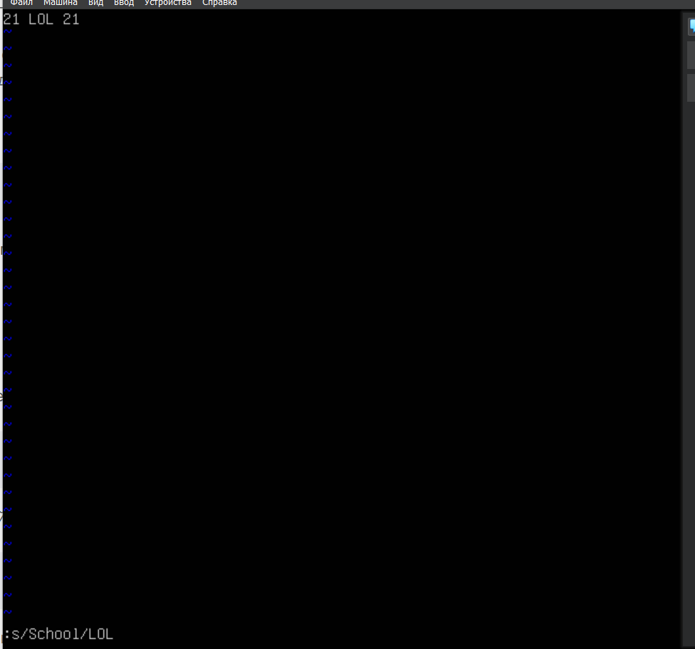

## 1. Part 1. Установка ОС
1. Установка Ubuntu Server 20.04 LTS без графического интерфейса
___
2. Вывод версии Убунту в консоли:

## Part 2. Создание пользователя
1. Создание пользователя, отличного от начального, который был задан при установке:
   
___

2.  Добавление пользователя в группу adm:
   
___
3. Вывод команды  `cat /etc/passwd`:
   

## Part 3. Настройка сети ОС
1. Задаем машине имя __user-1__:
   
   ___
2. Установить временную зону, соответствующую моему текущему местоположению:
   
   ___
3. Вывести названия сетевых интерфейсов с помощью консольной команды:
   
   >(lo) Loopback — виртуальный интерфейс, который по умолчанию присутствует в любом Linux. Это совокупность методов, нужных для корректной работы маршрутизатора и передачи данных. Сам интерфейс же является отображением логических процессов в маршрутизаторе. Также саму технологию используют и для других целей: тестирование передачи данных от обслуживающего центра коммутации; проверка сигнала на расстоянии; обеспечение работы коммутационных кабелей и их проверка; тест обратной петли, когда сигнал посылается и возвращается отправителю по всем коммуникационным каналам.
   ___
4. Используя консольную команду получить ip адрес устройства  от DHCP сервера:`10.0.2.15`
   
   
   >Протокол DHCP (Dynamic Host Configuration Protocol) относится к числу основных служб, формирующих инфраструктуру сетей. Он применяется для автоматического выполнения конфигурации сетевых параметров.
___
1. Определить и вывести на экран внешний ip-адрес шлюза (ip) и внутренний IP-адрес шлюза, он же ip-адрес по умолчанию (gw) :
   * Внешний несколько способов через команду `curl`, мой внешний ip : `79.172.16.100`

    * Мой внутренний ip : `10.0.2.15`
    
    ___
1. Задать статичные (заданные вручную, а не полученные от DHCP сервера) настройки ip, gw, dns (использовать публичный DNS серверы, например 1.1.1.1 или 8.8.8.8) : 
  * Использовал команду `sudo vim /etc/netplan/00-installer-config.yaml` чтобы изменить настройки адреса вручную и привел в такой вид:
  

  * Сохранил настройки с помощью команды `sudo netplan apply`
  * Через команду `ip route` увидел статический адрес:
  

  * После перезагрузки изменения сохранились:
  

  * Пропинговал удаленные хосты 1.1.1.1 и ya.ru:
  

## Part 4. Обновление ОС
1. Использовал команду `sudo apt update` для синхронизации пакетов
   ___
2. Использовал команду `sudo apt upgrade` для обновления 
   ___
3. Повторно запускаем предыдущую команду для проверки, что больше обновлений нет:

## Part 5. Использование команды sudo
1. Разрешить пользователю использовать команду sudo:
   
   ___
2. Поменял hostname от имени нового пользователя s21user:
   * Переключился на пользователя благодаря команде `su s21user`
   * Поменял hostname c помощью команды `sudo hostname`
  
> Sudo - это альтернатива su для выполнения команд с правами суперпользователя (root). В отличие от su, который запускает оболочку с правами root и даёт всем дальнейшим командам root-права, sudo предоставляет временное повышение привилегий для одной команды. Предоставляя привилегии root только при необходимости, sudo снижает вероятность того, что опечатка или ошибка в выполняемой команде произведут в системе разрушительные действия.
## Part 6. Установка и настройка службы времени
1. Установил `ntp` пакет
   ___
2. Установил `apt install systemd-timesyncd`
   ___
3. Включил синхронизацию `timedatectl set-ntp true`
   ____
4. Вывод в консоль:
  
## Part 7. Установка и использование текстовых редакторов

1. Используя каждый из трех выбранных редакторов, создайте файл test_X.txt, где X -- название редактора, в котором создан файл. Напишите в нём свой никнейм, закройте файл с сохранением изменений:
   * __vim__
  
Для выхода с сохранением использовал `:wq`

   * __nano__ 
   
Для выхода с сохранениеи использовал `ctrl + x` затем `y`
   *  __joe__
  
Для выхода с сохранениеи использовал `ctrl + k, x`

2.Используя каждый из трех выбранных редакторов, откройте файл на редактирование, отредактируйте файл, заменив никнейм на строку "21 School 21", закройте файл без сохранения изменений:
   * __vim__
  
  Для закрытия без изменений использовал `:q!`

  * __nano__
  
  Для закрытия без изменений использовал `ctrl + x, n`
  * __joe__
  
  Для закрытия без изменений использовал `ctrl + k, q, n`

3. Используя каждый из трех выбранных редакторов, отредактируйте файл ещё раз (по аналогии с предыдущим пунктом), а затем освойте функции поиска по содержимому файла (слово) и замены слова на любое другое:
   
   * __vim__
 
 Для поиска использовал переход в режим поиска с помощью `/`
  

Для замены в командном режиме использовал команду `:s/School/LOL`
  

   * __nano__ 
  
  Для поиска использовал `Ctrl + W`
  

  Для замены использовал `Ctrl + \`
  

  * __joe__ 
  
 Для поиска использовал `ctrl + k, f`
 

 Для замены использовал `ctrl +k, f, r, y`
 

## Part 8. Установка и базовая настройка сервиса SSHD
1. Установил службу SSHd: команда `sudo apt-get install ssh`
___
2.  При помощи команды `systemctl status sshd` увидел что служба enabled, значит она подключена в автозагрузке системы
   ___
3.  Перенастроил порт службы SSHD на 2022 с помощью  `sudo vim` открыл `/etc/ssh/sshd_config`. Я убрал коммент со строки `Port 22`, заменив на нужное значение и перезапустил службу при помощи `sudo systemctl restart ssh`
   ___
4.  Используя команду ps, показать наличие процесса sshd. Для этого к команде нужно подобрать ключи:
   Самая популярная форма поиска процессов `ps aux`. Используем ее вместе с `| grep ssh` чтобы найти интересущий нас процесс:
   
   >__-a__ 
Вывести информацию обо всех наиболее часто запрашиваемых процессах, то есть обо всех процессах, кроме лидеров групп и процессов, не ассоциированных с терминалом.

>__-u__ список_идентификаторов_пользователей
Выдавать информацию только о процессах с заданными идентификаторами или входными именами пользователей. Идентификатор пользователя выводится в числовом виде, а при наличии опции -f - в символьном.

> __-x__ указывает ps перечислить процессы без управляющего терминала. В основном это процессы, которые запускаются во время загрузки и работают в фоновом режимe.
___

5. Перезагрузил систему при помощи `reboot`
___
6. Вывод команды `netstat -tan`

> -a, (--all)
Отображать все сокеты (по умолчанию: подключено)

> -n, (--numeric)
	Показывать сетевые адреса как числа. netstat обычно показывает адреса как символы. Эту опцию можно использовать с любым форматом показа.

> -t (--tcp) показать tcp сокеты

Команда Netstat выводит статистику для следующих объектов.

> (Proto) Протокол. Имя протокола (TCP или UDP).

>   Recv-Q
Счётчик байт не скопированных программой пользователя из этого сокета.
    
 >   Send-Q
Счётчик байтов, не подтверждённых удалённым узлом.

>(Local Address) Локальные адреса.
IP-адрес локального компьютера и номер используемого порта. Имя локального компьютера, соответствующее IP-адресу и имени порта, выводится только в том случае, если не указан параметр -n. Если порт не назначен, вместо номера порта будет выведена звездочка (*).

>(Foreign Adress) Внешние адреса.
IP-адрес и номер порта удаленного компьютера, подключенного к данному сокету. Имена, соответствующие IP-адресу и порту, выводятся только в том случае, если не указан параметр -n. Если порт не назначен, вместо номера порта будет выведена звездочка (*).

> (State) Состояние. 
Указание состояния подключения.
LISTEN - Сокет ожидает входящих подключений.

>0.0.0.0 — это самый первый IP адрес. Но он относится к IP специального назначения (как например 127.0.0.1) и выполняет разные функции. Обозначение 0.0.0.0 может иметь разное значение в зависимости от того, где используется. Когда говорят о прослушиваемых портах, это обозначение в Linux символизирует заполнитель, то есть означает «любой IP адрес».

## Part 9. Установка и использование утилит top, htop 

1. Установка утилит не потребовалось, так как они уже были установлены.
___

2. Отчет оп top:
   По выводу команды top определить и написать в отчёте:

* uptime - 32 min
* количество авторизованных пользователей - 1 user
 * общую загрузку системы - 0.00
* общее количество процессов - 119
* загрузку cpu - 0.0
* загрузку памяти - 174.7 из  7945.3
* pid процесса занимающего больше всего памяти - 1 
* pid процесса, занимающего больше всего процессорного времени 1221 

___

3. Отчет с выводом команды htop:
   
  ___по сортировке с помощью `F6`___
   
   * PID

* PERCENT_CPU
  

* PERCENT_MEM

* TIME

___По фильтру с помощью `F4`___

___По поиску с помощью `F3`___ (циркуляция по вариантам снова жмем `F3`)

___с добавленным выводом hostname, clock и uptime___

## Part 10. Использование утилиты fdisk

В отчёте написал название жесткого диска, его размер и количество секторов, а также размер swap: 

 * Название VBOX HARDDISK
 * Размер 20 GB
 * Количество секторов 41943040
 * Размер swap (команда `free -h`) 0 байт
  

## Part 11. Использование утилиты df

1. Отчет команды `df`:
   * размер раздела - 10218772
   * размер занятого пространства - 2722756
   * размер свободного пространства - 6955344
   * процент использования - 29%
   * По умолчанию все размеры выдаются в блоках по 1 Кб равному 1024 байт, (если размер блока не задан опцией)
  
  

____

2. Отчет команды `df -Th`:
   * размер раздела - 9.8 Гб
   * размер занятого пространства - 2.6 Гб
   * размер свободного пространства - 6.7 Гб
   * процент использования - 29%
   * Ext4 — журналируемая файловая система, предлагаемая для использования по умолчанию инсталятором Ubuntu, начиная с версии 9.10.
  
  

## Part 12. Использование утилиты du

1. Вывод размер папок /home, /var, /var/log (в байтах, в человекочитаемом виде):

____
2. Вывод размера всего содержимого в /var/log (не общее, а каждого вложенного элемента, используя *):

 

 ## Part 13. Установка и использование утилиты ncdu

 * /home
  
  

* /var

* /var/log

## Part 14. Работа с системными журналами

1. Написал в отчете :
   * Время успешной последней авторизации - 04:09:17
   * Имя пользователя - runcelka
   * Метод входа в систему - c помощью идентификатора пользователя в системе — UID (User ID) 
  

___

2. Вставил в отчёт скрин с сообщением о рестарте службы (искал в syslog):

## Part 15. Использование планировщика заданий CRON

1. Создание задачи при помощи `crontab -e`:
   
   
___

2. Просмотр текущих задач при помощи `crontab -l`

____

3. Выполнение задачи в логах 

____

4. Удаление задачи и отсутствие текущих задач
   
